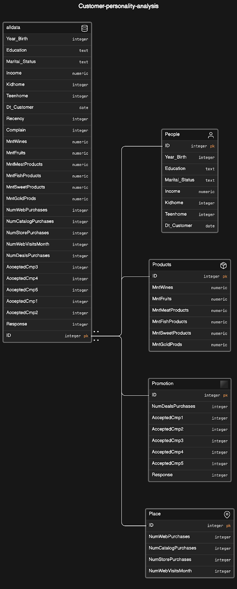
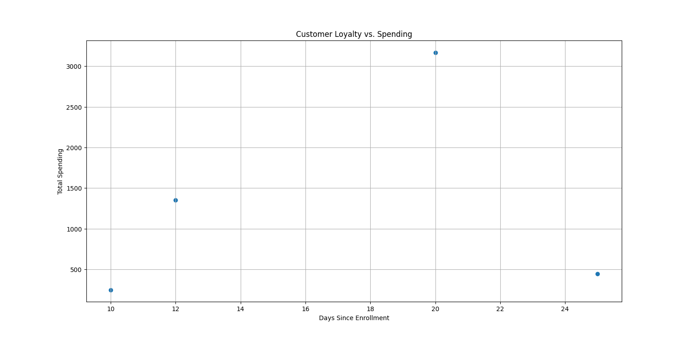
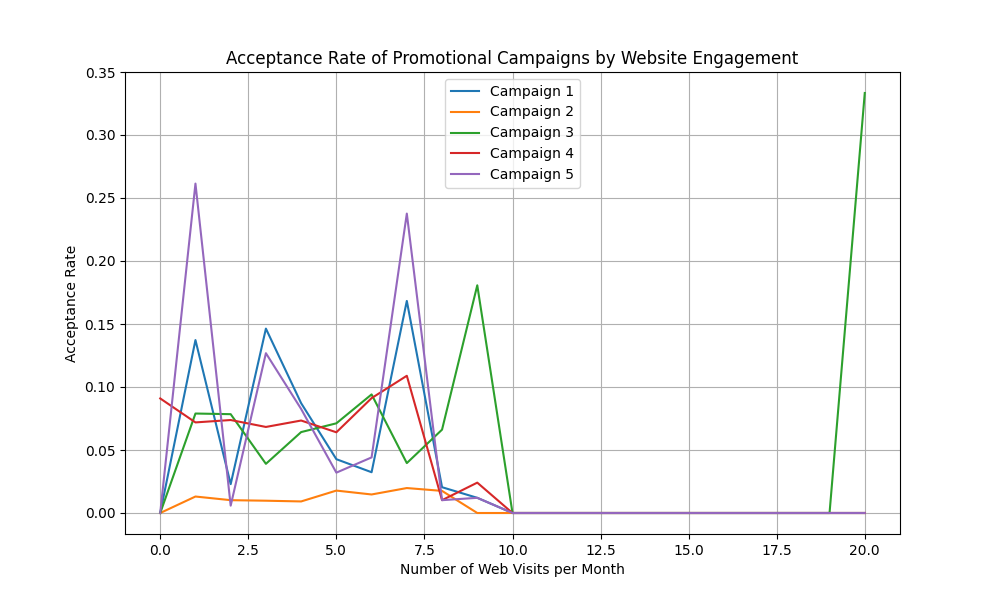

# Customer Personality Analysis - ELT Pipeline

## Overview

The Customer Personality Analysis project involves developing an Extract, Load, Transform (ELT) pipeline to analyze customer behavior and preferences. This pipeline transfers data from a local CSV file to a PostgreSQL database, performs data transformations, and generates reports based on the transformed data. The project aims to provide insights into customer demographics, spending habits, campaign responsiveness, and other relevant factors.

## Dataset Details

### Context

Customer Personality Analysis is a detailed analysis of a company’s ideal customers. It helps a business to better understand its customers and makes it easier for them to modify products according to the specific needs, behaviors, and concerns of different types of customers.

### Problem Statement

Customer personality analysis helps a business to modify its product based on its target customers from different types of customer segments. For example, instead of spending money to market a new product to every customer in the company’s database, a company can analyze which customer segment is most likely to buy the product and then market the product only on that particular segment.

### Attributes

#### People

- ID: Customer's unique identifier
- Year_Birth: Customer's birth year
- Education: Customer's education level
- Marital_Status: Customer's marital status
- Income: Customer's yearly household income
- Kidhome: Number of children in customer's household
- Teenhome: Number of teenagers in customer's household
- Dt_Customer: Date of customer's enrollment with the company
- Recency: Number of days since customer's last purchase
- Complain: 1 if the customer complained in the last 2 years, 0 otherwise

#### Products

- MntWines: Amount spent on wine in last 2 years
- MntFruits: Amount spent on fruits in last 2 years
- MntMeatProducts: Amount spent on meat in last 2 years
- MntFishProducts: Amount spent on fish in last 2 years
- MntSweetProducts: Amount spent on sweets in last 2 years
- MntGoldProds: Amount spent on gold in last 2 years

#### Promotion

- NumDealsPurchases: Number of purchases made with a discount
- AcceptedCmp1: 1 if customer accepted the offer in the 1st campaign, 0 otherwise
- AcceptedCmp2: 1 if customer accepted the offer in the 2nd campaign, 0 otherwise
- AcceptedCmp3: 1 if customer accepted the offer in the 3rd campaign, 0 otherwise
- AcceptedCmp4: 1 if customer accepted the offer in the 4th campaign, 0 otherwise
- AcceptedCmp5: 1 if customer accepted the offer in the 5th campaign, 0 otherwise
- Response: 1 if customer accepted the offer in the last campaign, 0 otherwise

#### Place

- NumWebPurchases: Number of purchases made through the company’s website
- NumCatalogPurchases: Number of purchases made using a catalogue
- NumStorePurchases: Number of purchases made directly in stores
- NumWebVisitsMonth: Number of visits to company’s website in the last month

### Dataset File

The dataset folder contains the CSV file used for this project.
- **dataset1.csv**: This file contains the raw data used for the analysis. It includes information about customer attributes, product purchases, promotions, and places.

## Customer Personality Analysis ER Diagram

This ER diagram illustrates the database schema for the Customer Personality Analysis project. It depicts the entities, attributes, and relationships between the tables used in the analysis, including People, Products, Promotion, Place, and their respective attributes.




## Installation and Execution Instructions

### Prerequisites

Before setting up the project, ensure you have the following prerequisites installed on your machine:

- Python 3.x
- DBeaver (optional, for database management)
- Docker (optional, for Dockerized PostgreSQL setup)
- PostgreSQL (optional, for non-Docker setup)

### Setup Steps

1. **Clone the Repository:**
```
git clone https://github.com/MalshaDissanayake/customer-personality-analysis-elt.git
```

2. **Navigate to the Project Directory:**
```
cd customer-personality-analysis-elt
```

3. **Install DBeaver (Optional):**
- If you don't have DBeaver installed, download and install it from [DBeaver website](https://dbeaver.io/download/).

4. **Set Up PostgreSQL Database (Optional):**
- If using Docker:
  ```
  docker-compose up -d
  ```
- If using local PostgreSQL installation, ensure the database is running.

5. **Install Project Dependencies:**
```
poetry init
```
```
poetry shell
```
```
poetry add psycopg
```

6. **Run Data Loading Script:**
```
poetry run python src/extract.py
```

7. **Run Data Transformation Script:**
```
poetry run python src/transform.py
```

8. **Generate Reports:**
```
poetry run python src/report.py
```

## Entity-Relationship (ER) Diagram


## Repository Structure 
```
customer-personality-analysis-elt/
├── src/ # Python scripts
├── sql/ # Transformation SQL files
├── dataset/ # Dataset folder containing the CSV file
│ └── dataset1.csv # CSV file with the data
├── docs/
│ └── img/ # Diagrams and images
├── .gitignore # Git ignore file
├── LICENSE # MIT License file
├── poetry.lock # Poetry lock file
├── pyproject.toml # Poetry configuration file
└── README.md # Project README file
```
### Data Loading (extract.py)

1. **Script Description:**
   The `extract.py` script is responsible for loading the CSV file into a PostgreSQL database. It utilizes the psycopg library (version 3) for database interactions.

2. **Data Extraction Process:**
   - The script first establishes a connection to the PostgreSQL database using the psycopg library.
   - It then reads the CSV file containing the raw data.
   - Next, the script creates a table named "alldata" in the database to store the raw data from the CSV file.
   - The raw data is inserted into the "alldata" table in the PostgreSQL database.

3. **Implementation Details:**
   - The script utilizes the psycopg library to interact with the PostgreSQL database, allowing for efficient data loading and manipulation.
   - It ensures that the data is accurately loaded into the database table, preserving the integrity of the original dataset.

4. **Usage:**
   - To execute the data loading process, run the `extract.py` script using Python.
   - Ensure that the PostgreSQL database is running and accessible before executing the script.

## Transformation

The transformation questions are addressed using external SQL files located in the `sql` directory. Each SQL file corresponds to a specific transformation question and contains the necessary SQL queries. The `transform.py` script interacts with these files by executing the SQL queries against the PostgreSQL database.

### Transformation Questions:

1.Demographic Influence on Income and Spending
- SQL Query: Calculate the average annual income and average spending on wine, meat, fruits, etc., grouped by marital status and education level. This will help understand the impact of these demographic factors on spending habits.

2.Customer Loyalty vs. Spending:
- SQL Query: Analyze the correlation between the number of days since enrollment (calculated from Dt_Customer) and total spending across all product categories. This query aims to identify if longer-engaged customers tend to spend more.

3.Promotion Response by Demographics:
- SQL Query: For each promotional campaign (first to fifth), calculate the acceptance rate and then break down these rates by age and education level to see if certain demographics are more responsive to specific campaigns.

4.Complaints and Spending/Campaign Response:
- SQL Query: Compare average spending across product categories and campaign acceptance rates between customers who have and have not complained. This helps in understanding the impact of customer service issues on future spending and engagement.

5.Impact of Children and Teenagers on Spending:
- SQL Query: Examine how the presence of children and teenagers (using Kidhome and Teenhome counts) affects spending in different product categories, highlighting the influence of household composition on purchasing decisions.

6.Discount Purchases vs. Overall Spending:
- SQL Query: Investigate the relationship between the number of discount purchases (NumDealsPurchases) and total spending in each category, and assess if higher usage of discounts correlates with lower acceptance of promotional offers.

7.Online vs. Offline Purchase Preferences:
- SQL Query: Compare the total spending between customers preferring online purchases (NumWebPurchases) versus in-store purchases (NumStorePurchases), to identify distinct spending patterns.

8.Website Engagement and Promotion Response:
- SQL Query: Determine if a higher frequency of website visits (NumWebVisitsMonth) is associated with greater acceptance of promotional campaigns or increased spending, indicating the effectiveness of online engagement.

9.Catalogue Purchases, Demographics, and High-value Spending:
- SQL Query: Analyze the relationship between catalogue purchases (NumCatalogPurchases), customer demographics (age, income, education), and spending on luxury items like gold, to profile customers inclined towards high-value purchases.

10. High-Spend Customer Segments:
- SQL Query: Segment customers based on demographics, household composition, and engagement metrics (like campaign responses), and identify those segments which significantly exceed average spending in specific categories such as wines or meat products.

### Transformation Process
The transformation process involves executing SQL queries stored in external files located in the `sql` directory. These SQL files are categorized into three main types:

1. **Table Creation and Population:** SQL files responsible for creating tables (`CREATE TABLE` statements) and populating them with data from the `alldata` table. These files ensure that the necessary tables are set up in the database before performing any transformations.

2. **Transformation Queries:** SQL files containing queries to address each of the transformation questions outlined in the project requirements. These queries typically involve joining the relevant tables based on the common `ID` column and performing aggregations or calculations to derive insights from the data.

### Interaction with `transform.py`
The `transform.py` script orchestrates the entire transformation process by executing SQL files in a specific order:

1. **Table Creation and Population:** First, the script executes SQL files responsible for creating and populating the necessary tables (`People`, `Products`, `Promotion`, and `Place`) based on the provided `alldata` table.

2. **Transformation Queries:** Next, the script executes SQL files corresponding to each transformation question. These queries utilize the populated tables to derive insights into various aspects of customer behavior and preferences.

### Report Generation
The reporting aspect of the Customer Personality Analysis project involves generating insights and summaries based on the transformed data. The report is generated in the form of CSV files, with each file corresponding to a specific aspect of the analysis. The reporting process is facilitated by the report.py script, which executes transformation queries and exports the results to CSV files using the | (pipe) character as a separator.

### Report Generation Process

1. **Execution of Transformation Queries:** 
   Before generating the report, the `report.py` script executes transformation queries stored in this file. These queries are designed to address various aspects of customer behavior and preferences, as outlined in the project requirements.

2. **Data Extraction and Aggregation:** 
   The transformation queries extract relevant data from the database and perform aggregations, calculations, and data manipulations to derive meaningful insights. For example, queries may calculate average spending by demographic groups, analyze promotion response rates, or examine the impact of customer complaints on spending behavior.

3. **Export to CSV Files:** 
   Once the transformation queries are executed and the data is processed, the `report.py` script exports the results to CSV files. Each CSV file represents a specific analysis or aspect of the customer personality analysis. The data is formatted using the `|` (pipe) character as a delimiter to ensure compatibility with CSV formatting standards.


## Interpretation
Using our `report.py` file, we can obtain results for each transformation question as CSV files. Upon examining these results, we observe that some transformations can be interpreted easily, while others require further analysis or visualization.

For transformations like 4 (Complaints and Spending/Campaign Response) and 7 (Online vs. Offline Purchase Preferences), we can interpret the results on the spot. 

**Interpretation for Transformation 4 (Complaints and Spending/Campaign Response):**
- Customers who have not complained tend to have higher average spending across product categories compared to those who have complained.
-  Among customers who have not complained, the acceptance rates for campaign offers vary, with the highest acceptance rate observed for Campaign 3 (cmp3_acceptance_rate), followed by Campaigns 4 and 5. Campaign 
   2 has the lowest acceptance rate.
-  For customers who have complained, Campaign 3 has the highest acceptance rate, while Campaigns 1, 2, and 4 have zero acceptance rates, and Campaign 5 has a moderate acceptance rate.

**Interpretation for Transformation 7 (Online vs. Offline Purchase Preferences):**
- Customers who prefer offline purchases (in-store) have higher total spending compared to those who prefer online purchases.
- This suggests that there might be certain product categories or aspects of the shopping experience that are more conducive to offline purchases.
- Understanding the differences in spending behavior between online and offline customers can inform marketing strategies and channel-specific promotions.

For transformations like 2 (Customer Loyalty vs. Spending) and 8 (Website Engagement and Promotion Response), further analysis is required. Additionally, visualizations have been created to aid in understanding these transformations.

Transformations like 2 (Customer Loyalty vs. Spending) and 8 (Impact of Children and Teenagers on Spending) require further analysis to fully interpret the results.

**Interpretation for Transformation 2 (Customer Loyalty vs. Spending):**
- While the SQL query provides data on the correlation between the number of days since enrollment and total spending, deeper analysis is needed to understand the nature of this correlation. 
- Further exploration could involve visualizing the relationship between days since enrollment and spending, possibly using scatter plots or regression analysis to identify any patterns or trends.

Below is a plot that I have drawn for further understanding:




**Interpretation for Transformation 8 (Website Engagement and Promotion Response):**
- The SQL query analyzes the relationship between the frequency of website visits (NumWebVisitsMonth) and the acceptance rates of promotional campaigns.
- The results could indicate whether customers who visit the website more frequently are more likely to respond positively to promotional campaigns.
- To interpret the results, we would need to examine the trends in acceptance rates across different levels of website engagement. Higher acceptance rates for promotional campaigns could suggest that increased online engagement positively influences campaign response. Conversely, lower acceptance rates might indicate that other factors beyond website visits influence campaign response.
- Further analysis, such as plotting the acceptance rates against the frequency of website visits and conducting statistical tests, would provide deeper insights into the relationship between website engagement and promotion response. 

Below is a plot that I have drawn for further understanding:


## Assumptions and Important Decisions

- Assumption 1: The DBeaver application is used for database management. If you are using a different database management tool, adjust accordingly.
- Assumption 2: The database credentials (dbname, user, password, host, port) provided in the Python scripts are generic placeholders. Replace them with your actual database credentials.
- Assumption 3: SQL queries are written to create and populate four tables: People, Products, Promotion, and Place. These tables are created based on the given CSV file (`dataset1.csv`) and the specified schema.

## License

This project is licensed under the MIT License. See the [LICENSE](LICENSE) file for details.


